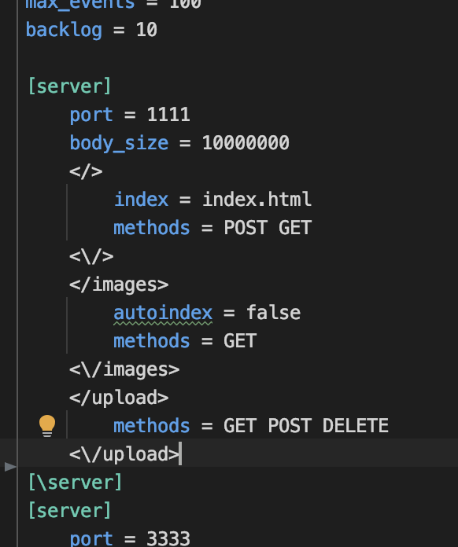
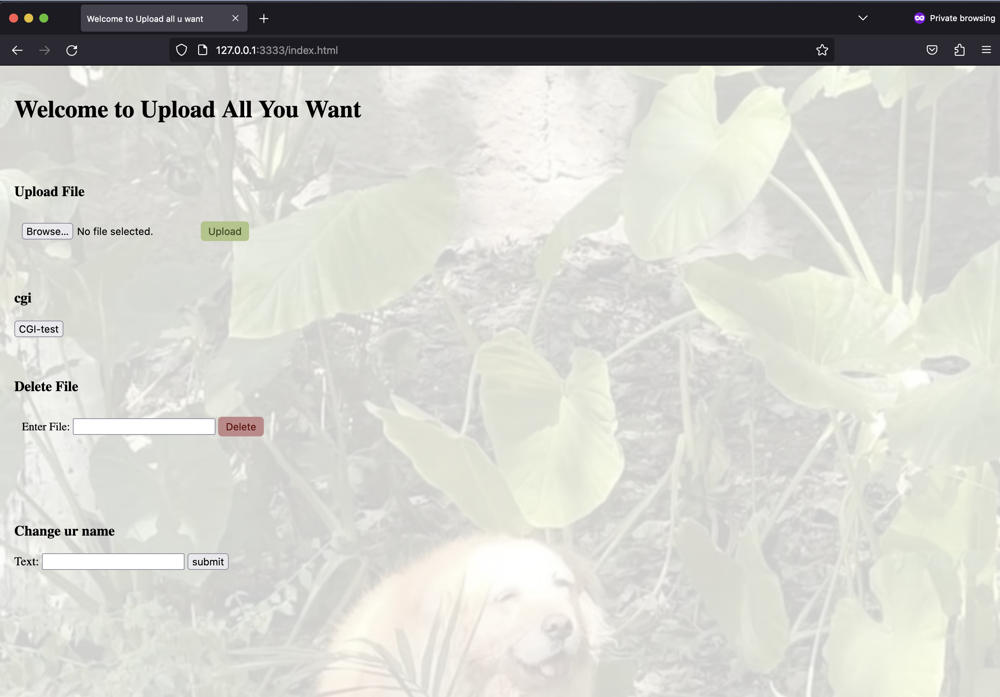

# WEBSERVE

<p align=>
    
</p>

# WEBSERVE - 42 Project

Webserv is a web server implementation project for the 42 school curriculum. <br>
This project aims to create a basic HTTP server capable of handling multiple client <br>
connections and serving static and dynamic content over HTTP.
<br><br>
## Table of Contents

- [**Key features**](#key-feautures)
- [**Requirements**](#requirements)
- [**Getting Started**](#getting-started)
- [**Configuration**](#config)
- [**Screenshots**](#screenshots)
  <br><br>
## Requirements
Install _Python_ and _Perl_ on your device (**CGI**)
1. **Python**
   ```sh
   sudo apt-get install python
   sudo apt-get install python-pip
2. **Perl**
   ```sh
   sudo apt-get install perl
   sudo apt-get install libcgi-pm-perl
<br>

## Key Feautures

- **Multi-Threaded:**&nbsp;&nbsp; *Handles multiple client connections concurrently.*

- **Configurable:**&nbsp;&nbsp; *Supports configuration files to customize server behavior.*

- **Static & Dynamic Content:**&nbsp;&nbsp; *Serves static files and processes dynamic content using server-side scripting.*

- **HTTP Protocol:**&nbsp;&nbsp; *Implements basic HTTP methods like GET, POST, DELETE.*

- **Scalable:**&nbsp;&nbsp; *Designed for scalability and optimal performance.*

  <br><br>
## Getting Started

1. Clone the repository:
   ```sh
   git clone https://github.com/mariekart42/WEBSERVE.git

2. Navigate to the project folder:
   ```sh
   cd WEBSERVE
   
3. Compile the project:
   ```sh
   make all

4. Run the game with a config file (keep it empty to use default config file):
   ```sh
   ./webserve (config.conf)
<br><br>
## Configuration
In the nginx like configuration File, you can change the Server Settings depending on your needs.
<p align="center">
    
    
</p>

We support: <br>
- **Global Settings:**
   - **Timeout** - time the server will wait for a client to complete a certain operation<br>
   - **Max_clients** - determines how many clients can be served at the same time<br>
   - **Body_size** - specifies the maximum size of the client request body<br>
   - **Max_events** - maximum number of connections each worker process can handle<br>
   - **Backlog** - maximum length of the queue of pending connections<br>
   - **Backlog** - maximum length of the queue of pending connections<br><br>
- **Server Settings:**
   - **Port** - communication endpoint that identifies a specific process or service on a host in a networked environment<br>
   - **Host** - specifies the host or domain names associated with this server block<br>
   - **Body_size** - same as in Global Settings, but specific for initialized server<br>
   - **Error_Page** - allows user to change default error pages to custom-made error pages <br><br>
- **Location Settings:**
   - **Methods** - lets you allow to only use specific HTTP Methods (we support *POST*, *GET* and *DELETE*)<br>
   - **Autoindex** - lets you enable or disable directory listing (listing of folders and subfolders)<br>
   - **Index** - specify the default file the Server should look for when a client accesses a directory<br>
   - **Redirect** - redirect the current path to the path specified after redirect<br>


<br><br>
## Screenshots

<p align="center">
    
    
<!--      -->
</p>
