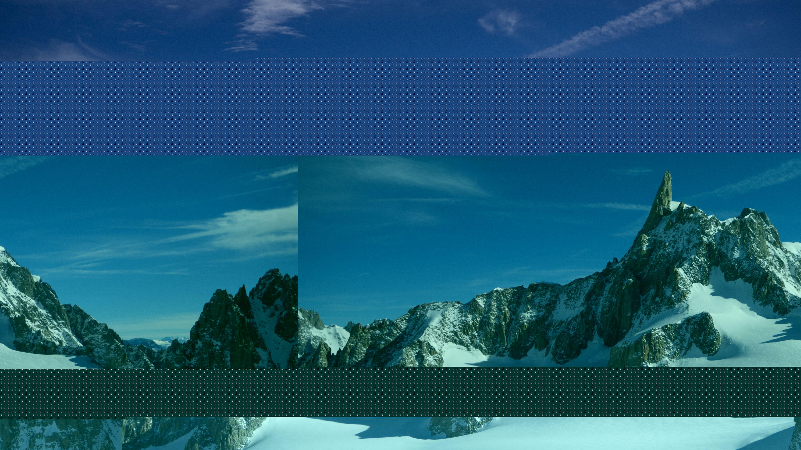

# WEBSERVE

<p align="center">
    
</p>

# FDF - 42 Project

Welcome to FDF, a 42 School project that explores 3D graphics using the wireframe representation of a 3D landscape.

## Table of Contents

- [About](#about)
- [Features](#features)
- [Getting Started](#getting-started)
- [Usage](#usage)
- [Screenshots](#screenshots)


## About

FDF is a graphic project that focuses on creating a simple 3D wireframe representation of a landscape from elevation data. The goal is to learn the basics of 3D graphics and provide users with an interactive view of various map scenarios.

## Features

- Render a 3D landscape using wireframe representation.
- Interpret elevation data from provided map files.
- Explore maps with customizable colors and depth settings.
- Control rotation, scaling, and movement of the rendered scene.
- Implement basic controls for interactivity.

## Getting Started

1. Clone the repository:
   ```sh
   git clone https://github.com/mariekart42/FDF.git

2. Navigate to the project folder:
   ```sh
   cd FDF
   
3. Compile the project:
   ```sh
   make

4. Run the game with a provided .cub map file:
   ```sh
   ./fdf maps/map.fdf

## Screenshots

<p align="center">
    
    
</p>
